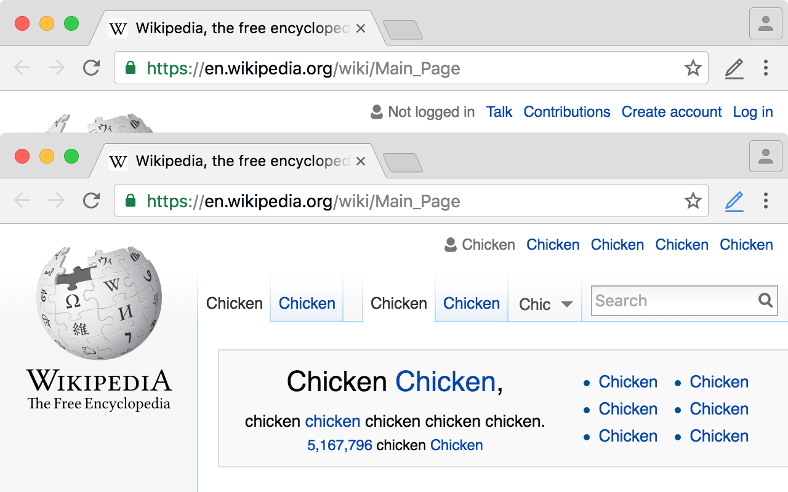
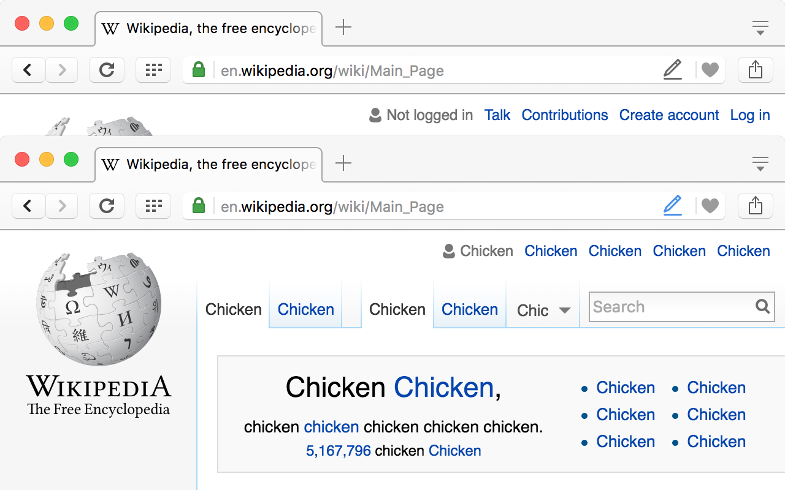

#  ContentEditable

Extension for [Chrome](https://chrome.google.com/webstore/detail/contenteditable/jphnpoochmeokkboopijkcncghifidhm) and **Opera** that makes pages editable by adding `contenteditable` attribute to the `<body>`. Press icon to start editing, press it again when you’re done. Once page is reloaded changes you’ve made are gone.

---
Licensed under MIT License
